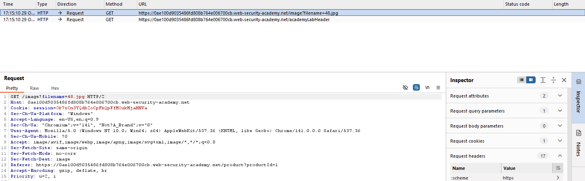
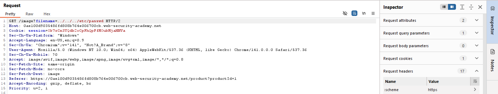
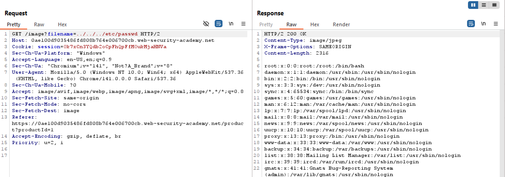
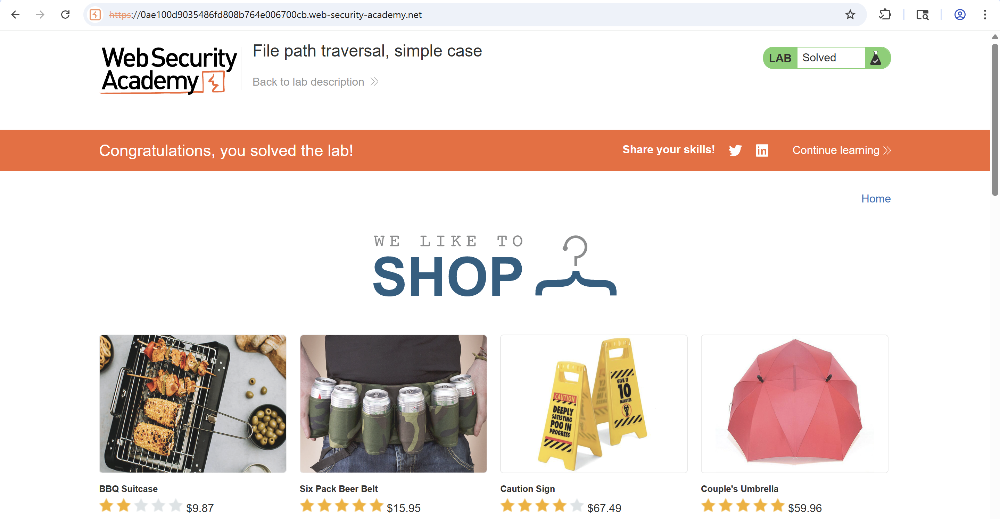

# Lab 1: File path traversal, simple case

## Tóm tắt

Khai thác lỗ hổng path traversal (directory traversal) tại chức năng hiển thị ảnh sản phẩm. Để hoàn thành bài lab, thực hiện truy xuất nội dung file /etc/passwd.

## Tóm tắt các bước thực hiện

### Bước 1: Dùng Burp Suit để chặn và sửa đổi gói tin khi tìm và load hình ảnh sản phẩm.

Chọn một hình ảnh sản phẩm trong khi bật Intercept on Burp Suit.

*Hình 1 — Bắt gói tin request*

### Bước 2: Sửa tham số `filename`.
Chỉnh sửa tham số `filename` trong request bắt được thành: `../../../etc/passwd`

*Hình 2 — Thay đổi filename của rquest"*

*Hình 3 — Phản hồi*

### Bước 3: Hoàn thành lab
Load trang và hoàn thành bài Lab.

*Hình 4 — Hoàn thành lab*

