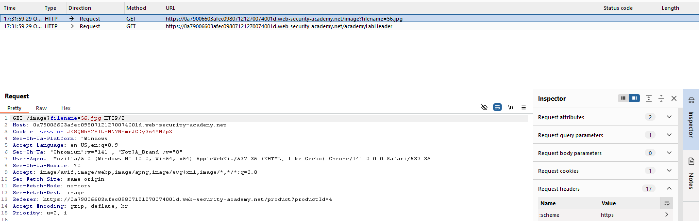
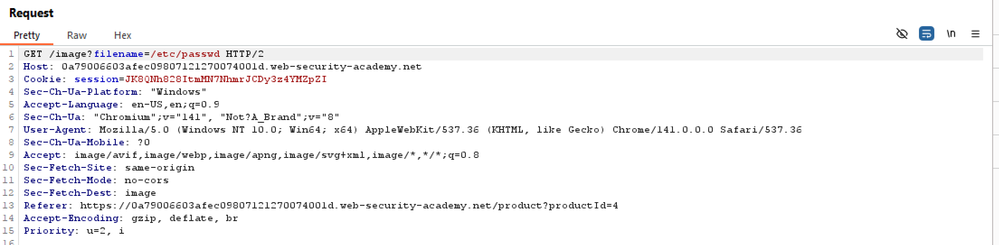
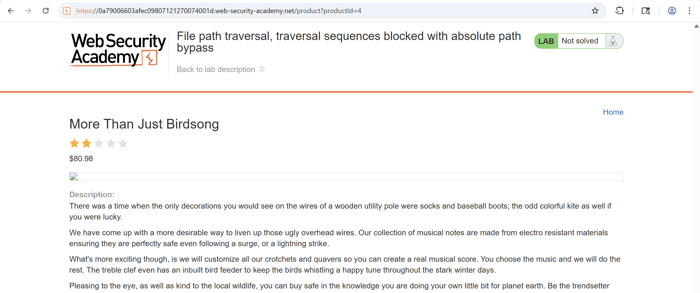
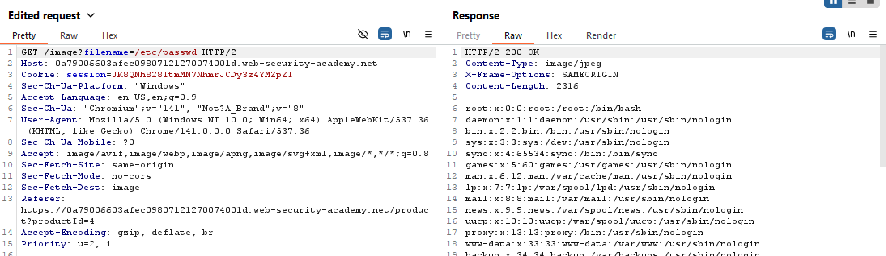
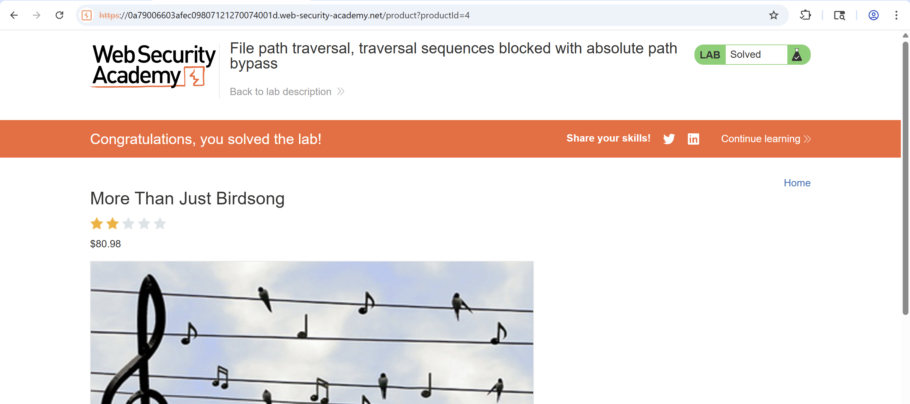

# Lab 2: File path traversal, traversal sequences blocked with absolute path bypass

## Tóm tắt

Khai thác lỗ hổng path traversal (directory traversal) tại chức năng hiển thị ảnh sản phẩm. 
Ứng dụng chặn các chuỗi vượt cấp thư mục nhưng coi tên tệp được cung cấp là liên quan đến một thư mục làm việc mặc định. Để hoàn thành bài lab, thực hiện truy xuất nội dung file /etc/passwd.

## Tóm tắt các bước thực hiện

### Bước 1: Dùng Burp Suit để chặn và sửa đổi gói tin khi tìm và load hình ảnh sản phẩm.

Chọn một hình ảnh sản phẩm trong khi bật Intercept on Burp Suit.

*Hình 1 — Bắt gói tin request*

### Bước 2: Sửa tham số `filename`.
Chỉnh sửa tham số `filename` trong request bắt được thành: `etc/passwd`. 

*Hình 2 — Thay đổi filename của rquest"*

### Bước 3: Quan sát phản hồi.
Ứng dụng được lập trình để tự động lấy đường dẫn của một thư mục cố định (thư mục mặc định) và ghép nó vào phía trước tên tệp mà người dùng cung cấp. Bộ lọc chỉ bận tâm đến ../ nhưng lại không kiểm tra xem người dùng có cung cấp một đường dẫn tuyệt đối (absolute path) hay không.

*Hình 3 - Phản hồi từ request*

*Hình 4 — Kiểm tra phản hồi*

### Bước 4: Hoàn thành lab.
Load lại trang và hoàn thành bài lab

*Hình 5 — Hoàn thành lab*
