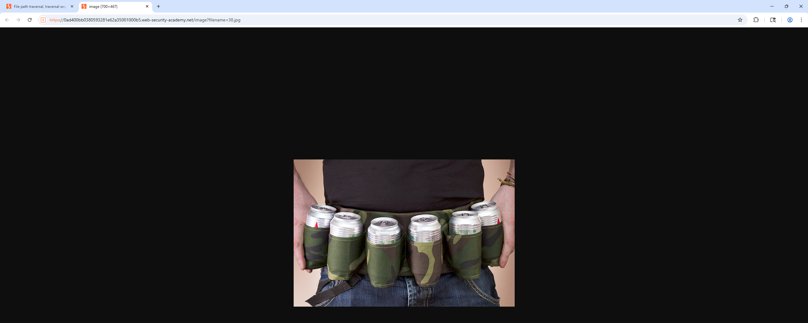
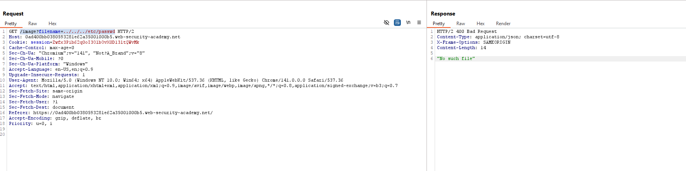
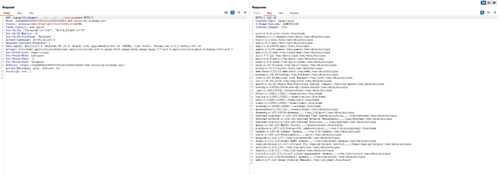

# Lab 3: File path traversal, traversal sequences stripped non-recursively

## Mục tiêu

Khai thác lỗ hổng path traversal (directory traversal) tại chức năng hiển thị ảnh sản phẩm.

## Tóm tắt các bước thực hiện

### Bước 1: Tìm URL cho phép truy xuất qua file từ input người dùng

Chúng ta sẽ chọn một ảnh bất kì và mở trong tab mới

*Hình 1 — URL dẫn đến file ảnh của hệ thống*

### Bước 2: Sửa payload để đến thư mục password
Ta thêm payload vào URL `../../../etc/passwd`

*Hình 2 — Server trả về "No such file"*

Ta đọc thêm gợi ý từ đề bài rằng các kỹ thuật path traversal bị loại bỏ nên ta sẽ thử gọi 2 lần `../` ở payload `....//....//....//etc/passwd`

*Hình 3 — Server trả về file passwd*

### Bước 3: Hoàn thành lab

*Hình 4 — Hoàn thành lab*
