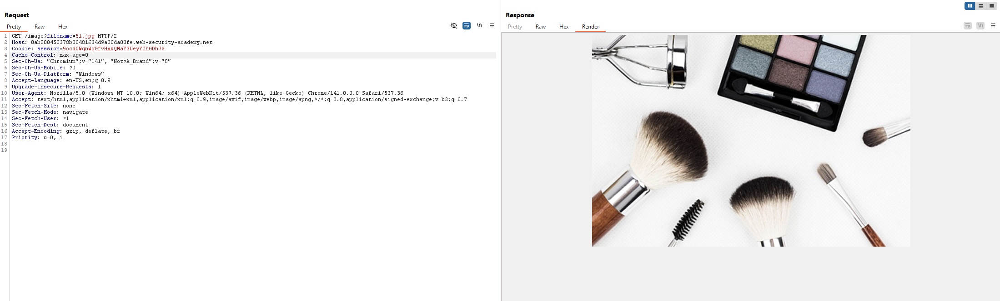
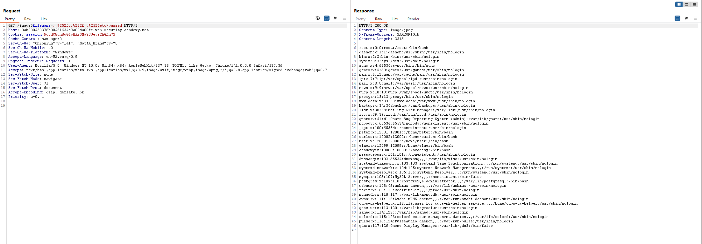

# Lab 4: File path traversal, traversal sequences stripped with superfluous URL-decode

## Mục tiêu

Phát hiện và khai thác lỗ hổng cho phép truy xuất file hệ thống thông qua cơ chế double URL encoding, vượt qua lớp bảo vệ loại bỏ chuỗi truy xuất thư mục `../`, nhằm đọc được các file nhạy cảm như /etc/passwd hoặc thực hiện truy cập file ngoài phạm vi cho phép.​

## Tóm tắt các bước thực hiện

### Bước 1: Tìm URL cho phép truy xuất qua file từ input người dùng

Chúng ta sẽ chọn một ảnh bất kì và mở trong tab mới

*Hình 1 — URL dẫn đến file ảnh của hệ thống*

### Bước 2: Sửa payload để đến thư mục password
Ta đọc thêm gợi ý từ đề bài rằng các kỹ thuật path traversal bị loại bỏ nên ta sẽ thử dùng encode `../` thành `..%252f`

*Hình 3 — Server trả về file passwd*

### Bước 3: Hoàn thành lab

*Hình 4 — Hoàn thành lab*
