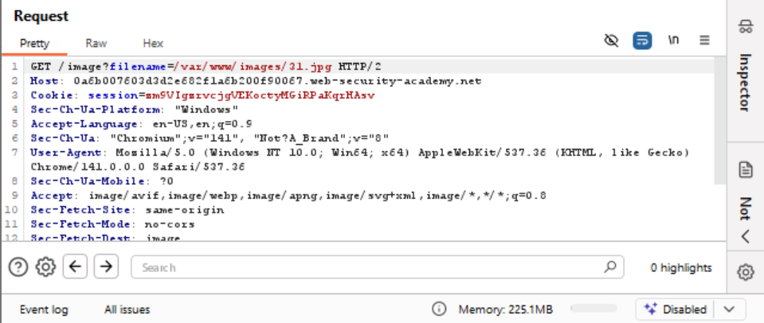

# Lab 5: File path traversal, validation of start of path

## Mục tiêu

Phát hiện và khai thác lỗ hổng path traversal trong chức năng hiển thị hình ảnh sản phẩm, khi ứng dụng chỉ xác thực đường dẫn tệp bắt đầu bằng thư mục hợp lệ /var/www/images/ mà không kiểm tra toàn bộ đường dẫn thực tế, cho phép kẻ tấn công chèn chuỗi truy xuất thư mục ../ để thoát khỏi phạm vi thư mục được phép.

## Tóm tắt các bước thực hiện

### Bước 1: Tìm URL yêu cầu lấy ảnh sản phẩm

Sử dụng Burp Suite và bật intercept, tìm đường dẫn chứa yêu cầu lấy hình ảnh sản phẩm

*Hình 1 - Bắt gói tin request hình ảnh sản phẩm.*

### Bước 2: Chỉnh sửa giá trị filename

Tại tham số filename, thay đổi giá trị ban đầu thành /var/www/image/../../../etc/passwd và tiến hành gửi đến server.

*Hình 2 - Thay đổi tham số filename.*

### Bước 3: Hoàn thành bài lab

Sau khi forward gói tin, chuyển qua tab HTTP history, tìm url chứa request đã forward trước đó và quan sát response được trả về. Đó chính là nội dung của tệp /etc/passwd.

*Hình 3 - Nội dung response trả về.*

Sau khi reload lại trang web, nhận được thông báo bài lab đã hoàn thành.

*Hình 4 - Thông báo hoàn thành bài lab.*

## Minh chứng hoàn thành

*Hình 5 - Minh chứng bài lab đã được giải.*