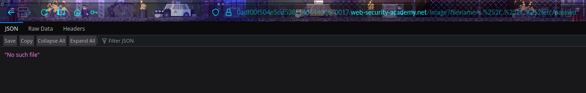

# Lab Report: File path traversal, validation of file extension with null byte bypass
---

## I. Overview and Goal, Tasks

This lab contains a path traversal vulnerability in the display of product images.
The application validates that the supplied filename ends with the expected file extension.

To solve the lab, retrieve the contents of the /etc/passwd file. 
---

## II. Implementation Steps & Documentation

This section walks through the process step-by-step. For each step, provide a clear explanation of what was done and include a corresponding screenshot to visually confirm the action or result.

### Overview and evaluation of the approach to the exercise

**Step 1: First, we will access the Lab website to check.**

*Action:* According to the hint, this exercise will be about File path traversal, so we will try to check any image to see how the system queries images.

*Evidence:*

> *Figure 1: Main page.*

*Evidence:*

> *Figure 2: Try to open an image with URL.*

---

**Step 2:  Check common cases**

*Action:* Next, we see that image files are queried by file name and are not encrypted. Therefore, we can check the paths to access the etc/passwd file.

*Evidence:*

> *Figure 3: Using ..etc/passwd*

*Evidence:*

> *Figure 4: Using URL encode."

---

**Step 3: Evaluate and propose appropriate measures**

*Action:* Simple methods are ineffective, perhaps the system is fully secured. It is possible that this system requires a file extension to fulfill the request, in this case, that is .png.

```bash
../../../etc/passwd%00.png
```

*Evidence:*

> *Figure 5: Try with file extension.*

---
### Result:

*Action:* After try with .png, we've got this following result:

*Evidence:*

> *Figure 6: Result.*

---

## III. References
- <a href="https://portswigger.net/web-security/file-path-traversal/lab-validate-file-extension-null-byte-bypass">File path traversal, validation of file extension with null byte bypass</a>